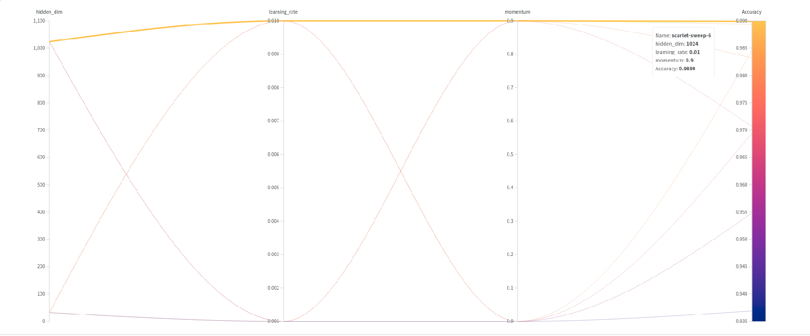

# MNIST-SGD-WandB-Template

This repository contains a notebook template for training a small network on the MNIST dataset for 5 epochs using Stochastic Gradient Descent (SGD). The training and testing processes are seamlessly logged using the powerful Weights and Biases (wandb) framework. The project is organized under the name "wandb-tutorial" within Weights and Biases.

The notebook demonstrates the integration of wandb's sweep feature, allowing for experimentation with different configurations. This empowers users to explore and compare the performance of the network under various settings, making hyperparameter tuning and optimization more efficient.

To simplify the implementation of wandb into the model, a class object is provided, streamlining the logging process and ensuring seamless integration with wandb's logging functionalities.

Whether you are a beginner looking to learn MNIST training with SGD and wandb or an experienced practitioner seeking to leverage wandb's advanced features for efficient experimentation and tracking, this repository provides a comprehensive template and documentation to guide you through the process. Start logging your experiments and optimizing your model's performance with wandb today!

The second cell in the wandb_template.ipython is given below:

```python
import wandb
from wandb.keras import WandbCallback
import torch.onnx

class Config:
    def __init__(self):
        self.model = None
        self.optimizer = None
        self.criterion = F.nll_loss
        self.train_dataloader= None
        self.test_dataloader = None
        self.log_freq = 10
        self.sweep = {  "name" : "wandb-tutorial",
                        "method" : "grid",
                        "parameters" : {
                            "learning_rate" : {
                                "values" : [0.01, 0.001]
                            },
                            "hidden_dim" :{
                                "values" : [32, 1024]
                            },
                            "momentum" :{
                                "values" : [0,0.9]
                            }
                        }
                      }
        

def grid_search(config):
    sweep_id = wandb.sweep(config.sweep, entity = "cagnur", project="wandb-tutorial")
    
    def train_for_five_epochs():
        wandb.init()
        # Training
        config.model = Net(wandb.config.hidden_dim).cuda()
        config.optimizer = torch.optim.SGD(config.model.parameters(), lr=wandb.config.learning_rate, momentum=wandb.config.momentum)
        wandb.watch(config.model, config.criterion, log = 'all', log_freq = config.log_freq)
        config.model.train()
        counter = 0
        for epoch in range(5):            
            for imgs, labels in tqdm.tqdm(config.train_dataloader):
                imgs, labels = imgs.cuda(), labels.cuda()
                out = config.model(imgs)
                loss = config.criterion(out, labels)
                config.optimizer.zero_grad()
                loss.backward()
                config.optimizer.step()
                counter += 1
                if counter % 5 == 0:
                    wandb.log({'Loss': loss}, step = counter)
        # Training is done
        # Test
        config.model.eval()
        correct = 0
        with torch.no_grad():
            for imgs, labels in tqdm.tqdm(config.test_dataloader):
                imgs, labels = imgs.cuda(), labels.cuda()
                out = config.model(imgs)
                predictions = out.argmax(dim=1, keepdim=True)  
                correct += predictions.eq(labels.view_as(predictions)).sum().item()
        accuracy = correct/len(config.test_dataloader.dataset)
        wandb.log({"Accuracy":accuracy} )
        # Test is done
        # Export the model   
        torch.onnx.export(config.model,         # model being run 
                         imgs,     # model input (or a tuple for multiple inputs) 
                         "model.onnx",     # where to save the model  
                         export_params=True # store the trained parameter weights inside the model file 
                         )
        wandb.save("model.onnx")
    wandb.agent(sweep_id, function=train_for_five_epochs)

wandb.login()
config_info = Config()
config_info.train_dataloader = train_loader
config_info.test_dataloader = test_loader
grid_search(config_info)
```

I will show the codes that allow me to meet the given requirements.

- **Configs and hyperparameters
– Hidden layer size (32, 1024)
– Learning rate (0.001, 0.01)
– Momentum (0, 0.9)**

Instead of run these, I create a sweep feature of wandb:

```python
sweep_id = wandb.sweep(config.sweep, entity = "cagnur", project="wandb-tutorial")
```

- **Network parameters every ten iterations**
- **Gradients of network parameters every 10 iterations**

[wandb.watch](http://wandb.watch) method can do these. Because we select 'all', we have log of both of them. config.log_freq is 10 which corresponds to freq of log samples.

```python
wandb.watch(config.model, config.criterion, log = 'all', log_freq = config.log_freq)
```

- **Training loss every 5 iterations**

counter counts the number of iterations. If it is sth divided by 5,then take log.

```python
if counter % 5 == 0:
    wandb.log({'Loss': loss}, step = counter)
```

- **Test accuracy after the training. (not every epoch),**

After training phase, we calculate accuracy and keep it for this run.

```python
wandb.log({"Accuracy":accuracy} )
```

- **The final network parameters in ONNX format.**

Torch library has a function for this. After changing the format of the ONNX, we can save it with wandb. You can reach onnx file from files of the run in wandb.

```python
torch.onnx.export(config.model,         # model being run 
                         imgs,     # model input (or a tuple for multiple inputs) 
                         "model.onnx",     # where to save the model  
                         export_params=True # store the trained parameter weights inside the model file 
                         )
wandb.save("model.onnx")
```

**Comment**

I have two sweep results. Following corresponds to the fresh one. We can visualize it with the given image thank to wandb.sweep:

 



Although this sweeping result states that the higher accuracy is obtained with:

- hidden num = 1024
- momentum = 0.9
- learning_rate = 0.01,

with different initialization, I got different results.
